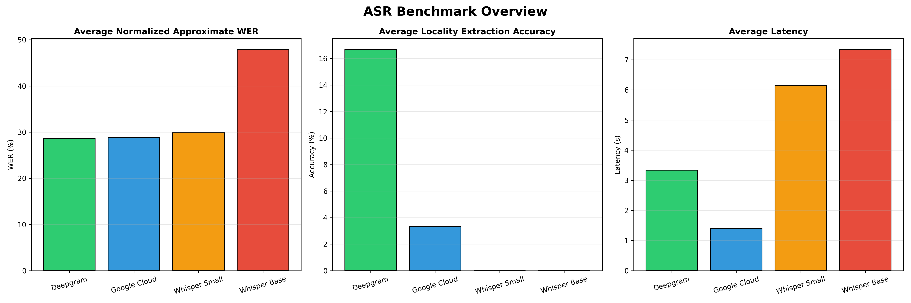
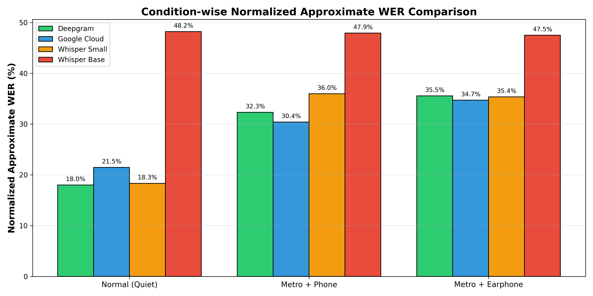
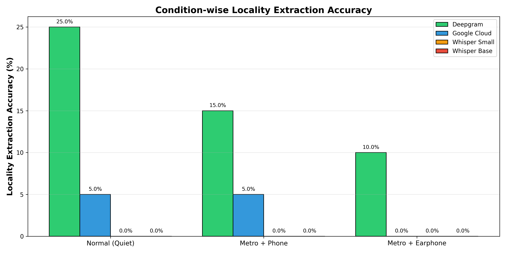
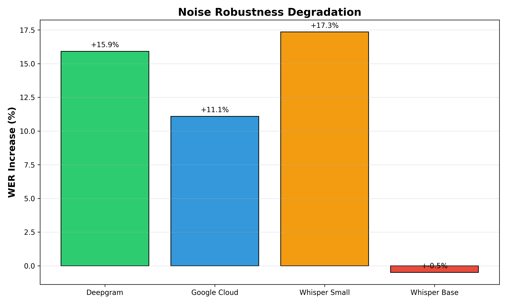
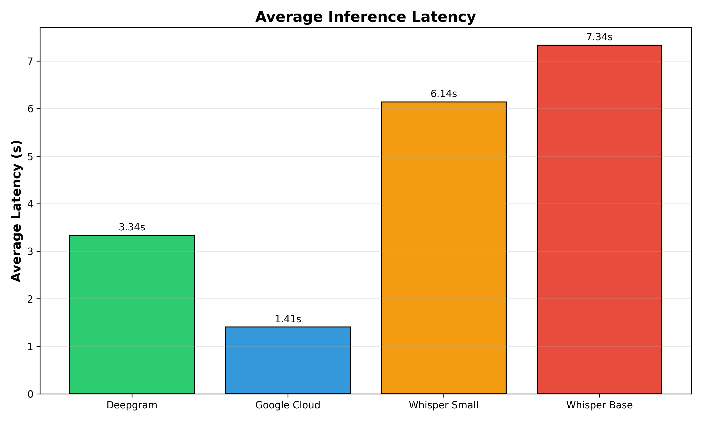

# ASR Benchmark for Indian Conversational Speech

Benchmarking multiple ASR systems on Hindi/Hinglish conversational speech under realistic noisy conditions for a blue-collar hiring platform.

**Goal:** Evaluate which ASR system performs best for conversational transcription and locality extraction in real-world Indian audio environments.

---

# Quick Results

| Model | Quiet WER (%) | Noisy WER (%) | Locality Extraction Accuracy (%) | Avg Latency (s) |
|---|---|---|---|---|
| **Deepgram** | **18.01** | **33.92** | **16.67** | **3.34** |
| Google Cloud | 21.46 | 32.55 | 3.33 | 1.41 |
| Whisper Small | 18.31 | 35.66 | 0.00 | 6.14 |
| Whisper Base | 48.20 | 47.71 | 0.00 | 7.34 |

### Key Observation

Deepgram delivered the strongest overall performance, particularly for locality extraction and robustness under noisy metro conditions.

---

# Visualizations

## Overall Benchmark Overview



## Condition-wise Normalized Approximate WER Comparison



## Condition-wise Locality Extraction Accuracy



## Noise Robustness Degradation



## Average Inference Latency



---

# Dataset

Custom dataset containing **60 audio samples** recorded under realistic conversational conditions.

## Recording Conditions

- Quiet room + phone microphone
- Metro noise + phone microphone
- Metro noise + earphone microphone

## Language

- Hindi/Hinglish conversational speech

## Example Utterances

- “Haan main Indiranagar mein rehta hoon”
- “Mera ghar Whitefield mein hai”
- “Main KR Puram ke paas rehta hoon”

## Localities Included

Indiranagar, Koramangala, Whitefield, Electronic City, HSR Layout, KR Puram, Banashankari, Silk Board, Yelahanka, Yeshwanthpur and others.

---

# Models Evaluated

## Commercial APIs

- Deepgram Nova-2
- Google Cloud Speech-to-Text

## Open-Source Models

- Whisper Base (74M parameters)
- Whisper Small (244M parameters)

---

# Installation

Install project dependencies:

```bash
pip install -r requirements.txt
```

## Install ffmpeg (Windows)

```bash
choco install ffmpeg -y
```

---

# API Setup

## Deepgram API Key

Create a `.env` file in the project root:

```env
DEEPGRAM_API_KEY=your_api_key
```

---

## Google Cloud Credentials

Place the following file in the project root directory:

```plaintext
google-credentials.json
```

This file contains your Google Cloud Speech credentials.

---

# Usage

## Run Benchmark

```bash
python src/benchmark.py
```

## Calculate Metrics

```bash
python src/calculate_metrics_by_condition.py
```

## Generate Charts

```bash
python src/generate_charts.py
```

---

# Main Findings

- Deepgram achieved the strongest locality extraction performance across all recording conditions.
- Whisper Small performed competitively in quiet conditions but degraded significantly under metro noise.
- Google Cloud delivered the fastest inference speed but weaker locality extraction capability.
- Whisper Base showed minimal degradation under noise because baseline transcription quality was already consistently poor.
- Earphone microphone recordings slightly worsened ASR performance compared to direct phone microphone recordings in metro environments.
- Approximate WER alone was insufficient for evaluating conversational entity-focused ASR systems.
- Open-source Whisper models were significantly less reliable under noisy Indian conversational conditions compared to commercial APIs.

---

# Important Insight

This benchmark showed that transcription quality and entity extraction quality are not always strongly correlated.

Even when transcription quality degraded under noise, Deepgram still extracted locality names more reliably than other systems.

For hiring workflows, correct extraction of locality information can be more important than perfectly formatted transcription.

---

# Condition-wise Robustness Analysis

## Quiet Conditions

- Deepgram and Whisper Small performed similarly under clean audio.
- Whisper Small achieved strong transcription quality in low-noise environments.

## Metro Noise Conditions

- All models degraded significantly under metro background noise.
- Deepgram maintained the strongest robustness and locality extraction performance.
- Whisper Small experienced substantial degradation under noise despite good quiet-condition performance.

## Earphone Microphone Findings

- Metro recordings using earphone microphones slightly worsened ASR accuracy compared to direct phone microphones.
- Possible causes include weaker microphone quality, noise pickup, and compression artifacts.

---

# Failure Analysis Examples

Observed issues included:

- Locality corruption (“Yelahanka” → “yeh line ka”)
- Hallucinated outputs under heavy noise
- Script mismatch between Roman Hindi and Devanagari outputs
- Random multilingual outputs in low-capacity models
- Noise-induced transcription instability

Example hallucinated output from Whisper Base:

```plaintext
"My life feels so good for me."
```

generated for a noisy Hindi utterance.

---

# Evaluation Methodology

Normalized Approximate WER was estimated using similarity-based matching after script normalization and transliteration.

This approach was used because Hindi/Hinglish ASR outputs frequently contained:

- Devanagari vs Roman script mismatch
- spacing inconsistencies
- transliteration variation
- conversational spelling differences

Strict word-level WER would incorrectly penalize many semantically correct outputs under multilingual conditions.

---

# Recommendation

## Recommended System

**Deepgram Nova-2**

## Reasons

- Best overall robustness under noisy conditions
- Strongest locality extraction accuracy
- More stable conversational transcription
- Better practical deployment suitability
- Reliable performance across recording environments

---

## Suggested Production Architecture

```plaintext
Call Audio
   ↓
Deepgram ASR
   ↓
Custom NER Layer
   ↓
Job Matching Pipeline
```

---

## Important Note

All evaluated systems struggled significantly under noisy conversational Indian speech conditions. Additional improvements such as custom NER layers, confidence filtering, larger datasets, and multilingual fine-tuning would likely be required for reliable production deployment.

---

# Project Structure

```plaintext
asr-benchmark/
├── data/
│   ├── audio/
│   └── labels/
│
├── src/
│   ├── asr_engines/
│   ├── benchmark.py
│   ├── calculate_metrics.py
│   ├── calculate_metrics_by_condition.py
│   └── generate_charts.py
│
├── results/
│   ├── charts/
│   ├── metrics/
│   └── transcriptions/
│
├── REPORT.md
├── requirements.txt
└── README.md
```

---

# Documentation

- `REPORT.md` → Detailed technical report
- `results/metrics/` → Final evaluation metrics
- `results/charts/` → Visualizations and robustness analysis

---

# Limitations

- Small dataset size (60 recordings)
- Single speaker recordings
- Limited environmental diversity
- Short conversational utterances only
- No fine-tuning performed on open-source models

This benchmark should be considered exploratory rather than a definitive production evaluation.

---

# Conclusion

This project explored how modern ASR systems behave under noisy Indian conversational conditions involving locality-heavy Hindi/Hinglish speech.

The benchmark evolved beyond simple transcription evaluation into a robustness-focused analysis of conversational ASR behavior across multiple recording environments.

Among evaluated systems, Deepgram delivered the strongest overall performance and maintained the best balance between transcription quality, locality extraction, and environmental robustness.

The benchmark also highlighted the importance of:

- noise robustness
- multilingual evaluation
- entity extraction
- script normalization
- environmental testing
- failure analysis

---

**Last Updated:** May 2026