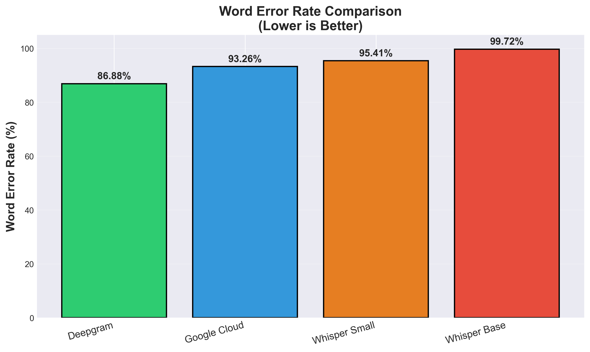
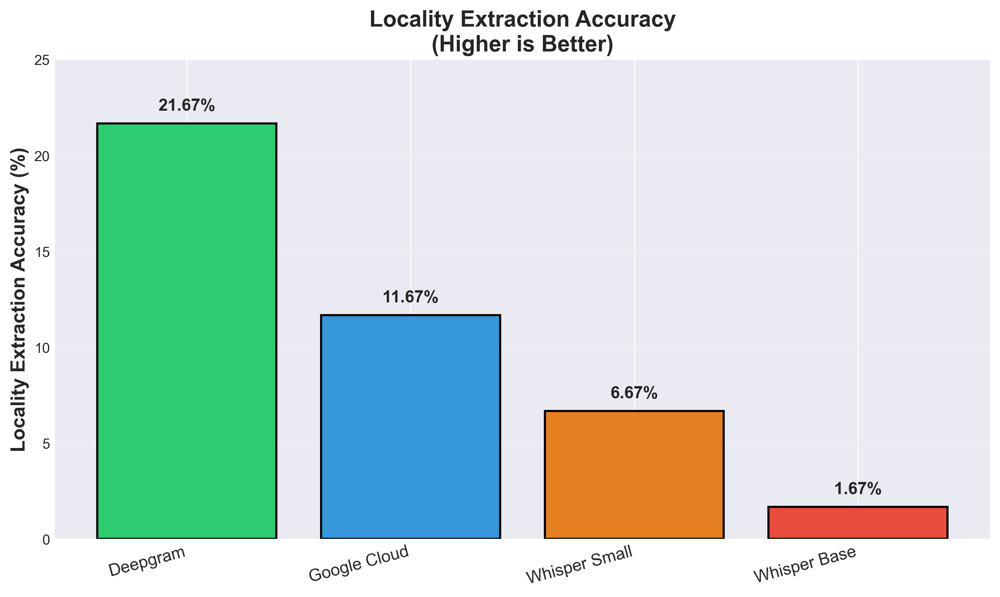

# ASR Benchmark for Indian Conversational Speech

Benchmarking 4 ASR systems (2 commercial + 2 open-source) on Hindi/Hinglish conversational speech for a blue-collar hiring platform.

**Goal:** Evaluate which ASR system performs best for extracting locality names from noisy conversational audio.

---

# Quick Results

| Model           | WER (%) | Locality Accuracy (%) | Avg Latency (s) |
|-----------------|---------|-----------------------|-----------------|
| **Deepgram**    | **86.88** | **21.67**           | **3.34**        |
| Google Cloud    | 93.26   | 11.67                 | 1.41            |
| Whisper Small   | 95.41   | 6.67                  | 6.14            |
| Whisper Base    | 99.72   | 1.67                  | 7.34            |

### Key Observation

Deepgram achieved the strongest overall performance among evaluated systems, particularly for locality extraction under noisy conditions.

---

# Visualizations

## Overall Performance


## Word Error Rate Comparison



## Locality Extraction Accuracy



## Noise Impact on WER


## Inference Latency Comparison


---

# Dataset

Custom dataset containing **60 audio samples** recorded under realistic conditions.

## Recording Conditions

- Quiet room + phone microphone
- Metro noise + phone microphone
- Metro noise + earphone microphone

## Language

- Hindi/Hinglish conversational speech

## Example Utterances

- “Haan main Indiranagar mein rehta hoon”
- “Mera ghar Whitefield mein hai”

## Localities Included

Indiranagar, Koramangala, Whitefield, Electronic City, HSR Layout, KR Puram, Banashankari, Silk Board, Yelahanka, Yeshwanthpur and others.

---

# Models Evaluated

## Commercial APIs

- Deepgram Nova-2
- Google Cloud Speech-to-Text

## Open-Source Models

- Whisper Base (74M parameters)
- Whisper Small (244M parameters)

---

# Installation

Install project dependencies:

```bash
pip install -r requirements.txt
```

## Install ffmpeg (Windows)

```bash
choco install ffmpeg -y
```

---

# API Setup

## Deepgram API Key

Create a `.env` file in the project root:

```env
DEEPGRAM_API_KEY=your_api_key
```

---

## Google Cloud Credentials

Place the following file in the project root directory:

```plaintext
google-credentials.json
```

This file contains your Google Cloud Speech credentials.

---

# Usage

## Run Benchmark

```bash
python src/benchmark.py
```

## Calculate Metrics

```bash
python src/calculate_metrics.py
```

## Generate Charts

```bash
python src/generate_charts.py
```

---

# Main Findings

- Deepgram achieved the lowest WER and highest locality extraction accuracy among evaluated systems.
- Google Cloud delivered faster inference but weaker locality extraction performance.
- Whisper Small performed better than Whisper Base, showing the impact of model size on multilingual ASR robustness.
- All evaluated systems degraded significantly under metro noise conditions.
- WER alone was insufficient for evaluating entity-centric conversational ASR systems.

---

# Important Insight

This benchmark showed that even when transcription quality was poor, some systems still extracted locality names correctly.

For hiring workflows, entity extraction quality can be more important than perfectly formatted transcription.

---

# Failure Analysis Examples

Observed issues included:

- Locality corruption (“Yelahanka” → “yeh line ka”)
- Hallucinated outputs under heavy noise
- Script switching in Whisper Base
- Random multilingual outputs in low-capacity models

Example hallucinated output from Whisper Base:

```plaintext
"My life feels so good for me."
```

generated for a noisy Hindi utterance.

---

# Recommendation

## Recommended System

**Deepgram Nova-2**

## Reasons

- Best locality extraction performance
- More stable under noisy conditions
- Better conversational robustness
- Production-ready deployment workflow

---

## Suggested Production Architecture

```plaintext
Call Audio
   ↓
Deepgram ASR
   ↓
Custom NER Layer
   ↓
Job Matching Pipeline
```

---

## Important Note

All evaluated systems struggled significantly with noisy Indian conversational speech. Additional improvements such as custom NER models, confidence filtering, and larger datasets would likely be required for reliable production deployment.

---

# Project Structure

```plaintext
asr-benchmark/
├── data/
│   ├── audio/
│   └── labels/
│
├── src/
│   ├── asr_engines/
│   ├── benchmark.py
│   ├── calculate_metrics.py
│   └── generate_charts.py
│
├── results/
│   ├── charts/
│   ├── metrics/
│   └── transcriptions/
│
├── REPORT.md
├── requirements.txt
└── README.md
```

---

# Documentation

- `REPORT.md` → Detailed technical report
- `results/metrics/` → Final evaluation metrics
- `results/charts/` → Visualizations and comparisons

---

# Limitations

- Small dataset size (60 recordings)
- Single speaker recordings
- Limited environmental noise diversity
- Short conversational utterances only

This benchmark should be considered exploratory rather than a definitive production evaluation.

---

# Conclusion

This project explored how modern ASR systems behave under noisy Indian conversational conditions involving locality-heavy Hindi/Hinglish speech.

Among evaluated systems, Deepgram delivered the strongest overall performance, while Whisper models struggled significantly without fine-tuning.

The benchmark also highlighted the importance of:

- noise robustness
- multilingual evaluation
- entity extraction
- script normalization
- failure analysis

---

**Last Updated:** May 2026